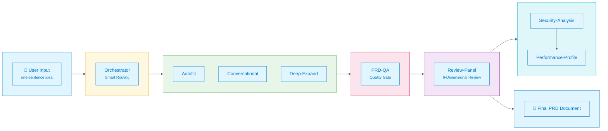
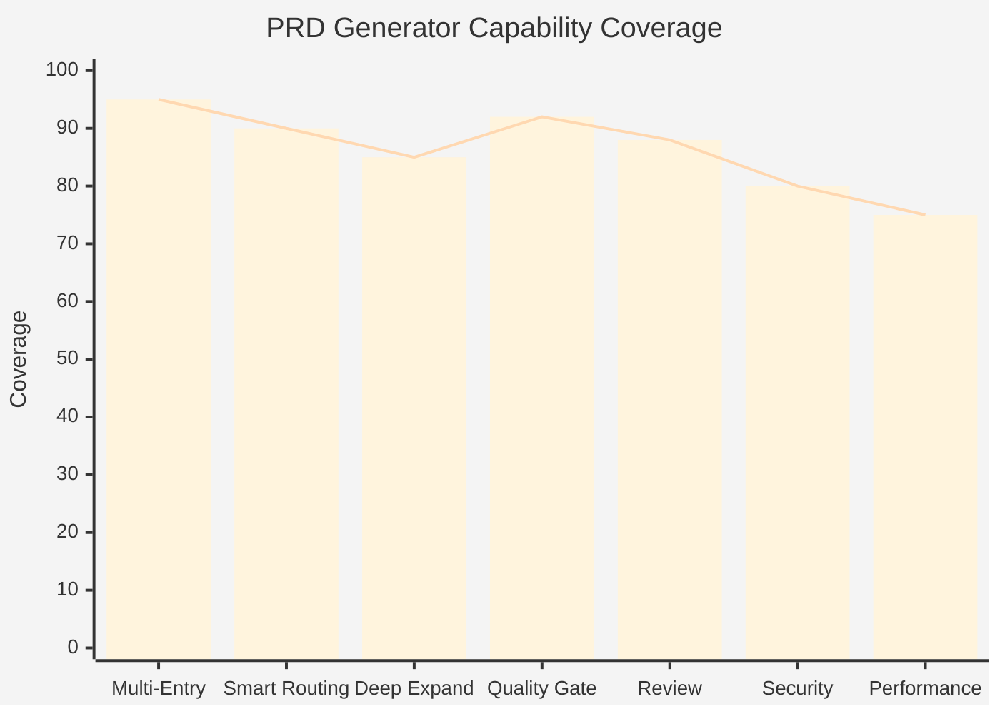
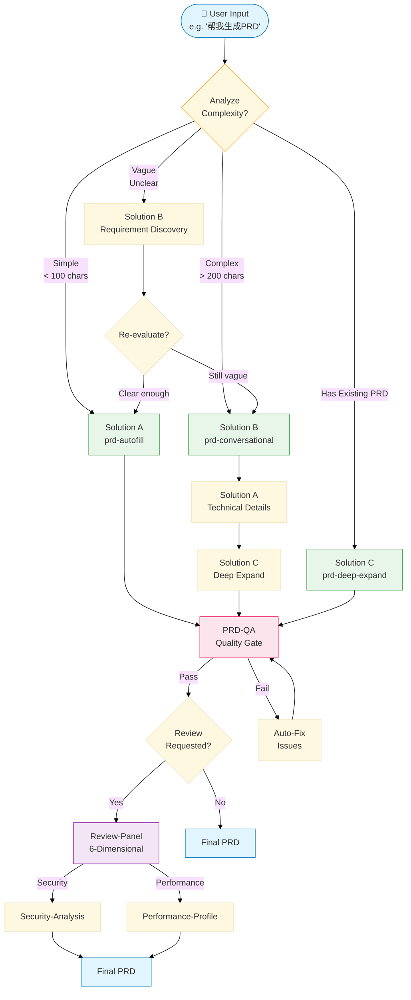
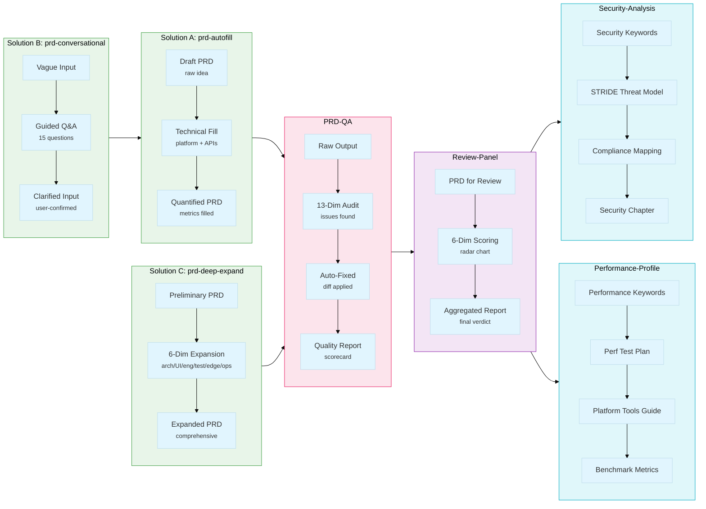
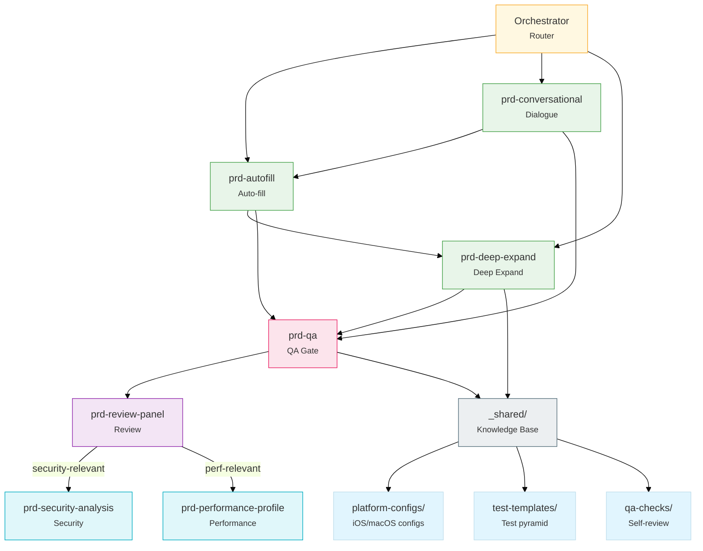
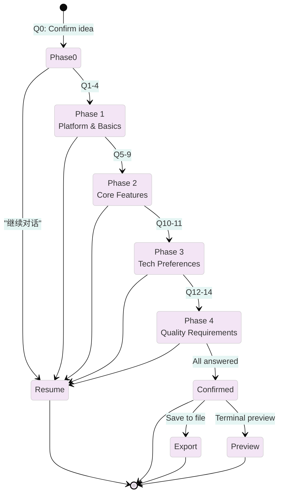
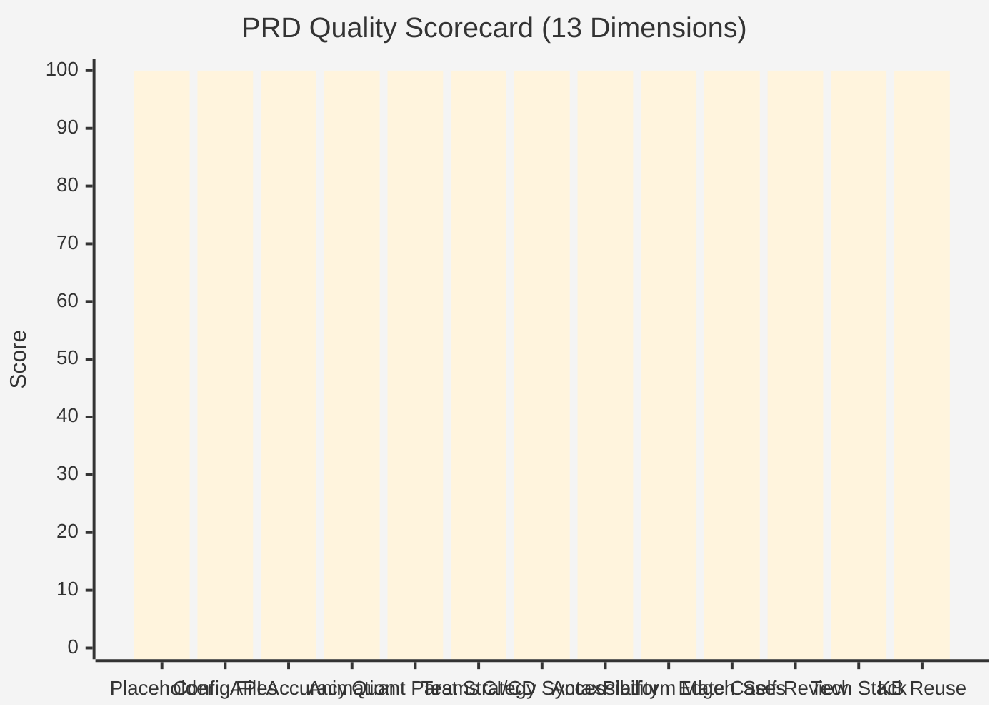

# PRD Generator

[](https://github.com/timywel)
[](LICENSE)
[](https://github.com/timywel/prompt-lab)

**Author & Maintainer**: [timywel](https://github.com/timywel)

---

PRD Generator is an AI-native Product Requirements Document (PRD) generation system. It is not a simple template-filling tool, but a **smart collaboration network** composed of 8 specialized skills -- from a one-sentence idea to an executable PRD, in just a few rounds of conversation.

---

## 1. Architecture Overview



---

## 2. Project Capabilities

### Capability Radar



| Capability | Description |
|-----------|------|
| **Multi-Entry Access** | One-sentence idea to turnkey PRD; or multi-round conversation for incremental clarification |
| **Smart Routing** | Automatically analyzes requirement complexity and matches the optimal generation strategy |
| **Deep Expansion** | Architecture design / UI/UX / Engineering / Testing / Edge cases / Operations |
| **Quality Gate** | Automatically reviews common PRD defects and outputs a quality report after fixes |
| **Professional Review** | 6-dimensional review panel (Technical Architecture, Product Design, Engineering Implementation, Executability, UI/UX, Testing Strategy) |
| **Security Hardening** | Threat modeling / Privacy compliance / Data encryption / API authentication -- automatically triggered for login/payment/data scenarios |
| **Performance Profiling** | Performance test plan / Platform tooling guide / Baseline metrics / Regression detection -- automatically triggered for high-performance scenarios |

---

## 3. Workflow Deep Dive

### 3.1 Orchestrator Decision Tree



### 3.2 PRD Data Flow Through Skills



### 3.3 Skill Collaboration Map



---

## 4. Skill Deep Dives

### 4.1 prd-autofill: 6-Step Pipeline


**Trigger**: Say `"帮我生成一个 macOS 语音输入 App 的 PRD"`

**Platforms**: macOS / iOS / Android / Web / CLI / Chrome Extension

### 4.2 prd-conversational: 15-Question State Machine



**15 Questions across 4 Phases**:

| Phase | Questions | Topics |
|-------|-----------|--------|
| 0 | 1 | Intent confirmation |
| 1 | 4 | Platform, version, MVP scope |
| 2 | 5 | Core features |
| 3 | 2 | Tech preferences |
| 4 | 3 | Quality requirements |

**Trigger**: Say `"开始对话式 PRD"`

### 4.3 prd-orchestrator: Complexity Decision Tree

| Input Type | Characteristics | Route |
|------------|----------------|-------|
| **Simple** | < 100 chars, single feature, common platform | Solution A only |
| **Existing PRD** | Provides text or file path | Solution C only |
| **Complex** | > 200 chars, multiple features, special platform | B → A → C |
| **Uncertain** | Vague description, unclear functionality | Solution B |

**Trigger**: Say `"帮我生成PRD"` (universal entry, no skill selection needed)

### 4.4 prd-qa: 13-Dimensional Quality Scorecard



| # | Dimension | Auto-Action if Missing |
|---|-----------|----------------------|
| 1 | No Placeholder | Scan [TODO]/[TBD]/[FIXME] |
| 2 | Config Files | Auto-inject Info.plist / Entitlements |
| 3 | API Accuracy | Detect platform/API mismatches |
| 4 | Animation Conflicts | Flag inconsistent duration values |
| 5 | Quant Params | Ensure delay/memory/CPU/framerate values |
| 6 | Test Strategy | Auto-inject test pyramid template |
| 7 | CI/CD Syntax | Fix `$${{ secrets }}` typos |
| 8 | Accessibility | VoiceOver / Dynamic Type / reduceMotion |
| 9 | Platform Consistency | Verify tech stack vs target |
| 10 | Edge Cases | Ensure count >= 10 |
| 11 | Self-Review Checklist | Auto-inject checklist template |
| 12 | Tech Stack Coverage | Full core API coverage check |
| 13 | Knowledge Base Reuse | Verify `_shared/` references |

**Trigger**: Say `"审查 PRD"` or auto-invoked after A/B/C output

### 4.5 Other Skills

| Skill | Trigger | Key Output |
|-------|---------|-----------|
| `prd-review-panel` | `"评审 PRD"` | 6-dim radar chart + aggregated report |
| `prd-security-analysis` | Login / Payment / Data keywords | STRIDE threat model + compliance map |
| `prd-performance-profile` | Real-time / Audio / Gaming keywords | Perf test plan + benchmark metrics |

---

## 5. Skills Overview

| Skill | Trigger Scenario | Core Value |
|------|----------|----------|
| `prd-autofill` | Quick start | One sentence in, detailed PRD out |
| `prd-conversational` | Vague requirements | Multi-round guidance, precise clarification |
| `prd-deep-expand` | Deep requirements | Full 6-dimensional expansion |
| `prd-orchestrator` | Universal entry | Smart analysis, automatic routing |
| `prd-qa` | Quality gate | Auto review + fix |
| `prd-review-panel` | Review stage | 6-dimensional comprehensive scoring |
| `prd-security-analysis` | Security-related | Threat modeling / Compliance / Encryption |
| `prd-performance-profile` | Performance-related | Test plan / Baseline metrics |

---

## 6. Supported Platforms

| Platform | Installation | Details |
|------|----------|----------|
| Claude Code | `make install-claude` | Project-level `.claude/skills/` |
| Cursor | `make install-cursor` | Project-level `.cursor/skills/` |
| Windsurf | `make install-windsurf` | Project-level `.windsurf/skills/` |
| OpenCode | `make install-opencode` | Global `~/.opencode/skills/prompt-lab` |
| VSCode | Manual install | See `adapters/vscode/README.md` |

---

## 7. Quick Start

### Method 1: Interactive Installation (Recommended)
```bash
./install.sh
```

### Method 2: Makefile Installation
```bash
# Install core platforms (Claude Code + Cursor + Windsurf)
make install

# Install all platforms
make install-all

# Install specific platform
make install-claude   # Claude Code
make install-cursor    # Cursor
make install-windsurf  # Windsurf
make install-opencode  # OpenCode (global)
```

---

## 8. Project Structure

```
prompt-lab/
├── skills/                    # Standardized skill source (shared across all platforms)
│   ├── _registry.yaml         # Skill registry
│   ├── _shared/               # Shared knowledge base
│   │   ├── platform-configs/  # iOS/macOS configuration templates
│   │   ├── qa-checks/         # Self-inspection checklists
│   │   └── test-templates/    # Test pyramid
│   └── prd-*/                 # 8 skill modules
├── adapters/                  # Platform adapters
│   ├── claude-code/          # Claude Code
│   ├── cursor/               # Cursor
│   ├── windsurf/             # Windsurf
│   ├── opencode/             # OpenCode
│   └── vscode/               # VSCode extension
├── docs/                      # Project documentation (PRD/Review/Standards)
├── Makefile                   # Cross-platform install/uninstall
├── install.sh                 # Interactive installation script
└── README.md
```

---

## 9. Uninstall

```bash
make uninstall
# Or run ./install.sh and select "Uninstall"
```

---

## 10. Locally Preserved Directories

The following directories contain local integration files and **will not** be uploaded to the repository:
- `tmp/` -- Session temporary files
- `baize-loop/` -- Local integration

---

## 11. Related Documentation

- [Claude Code Adapter](adapters/claude-code/README.md)
- [Cursor Adapter](adapters/cursor/README.md)
- [Windsurf Adapter](adapters/windsurf/README.md)
- [OpenCode Adapter](adapters/opencode/INSTALL.md)
- [VSCode Adapter](adapters/vscode/README.md)
