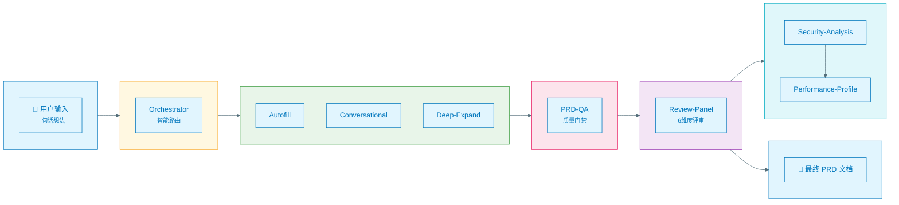
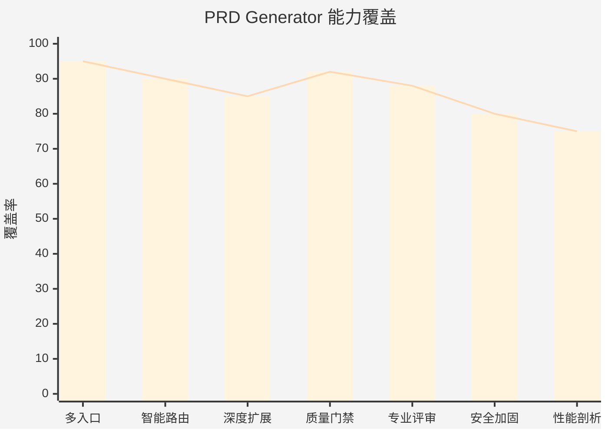
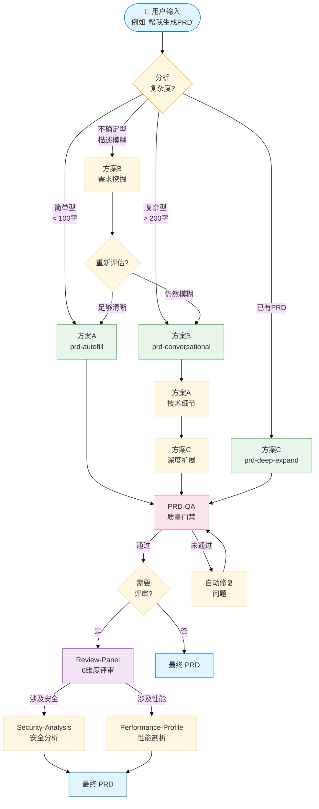
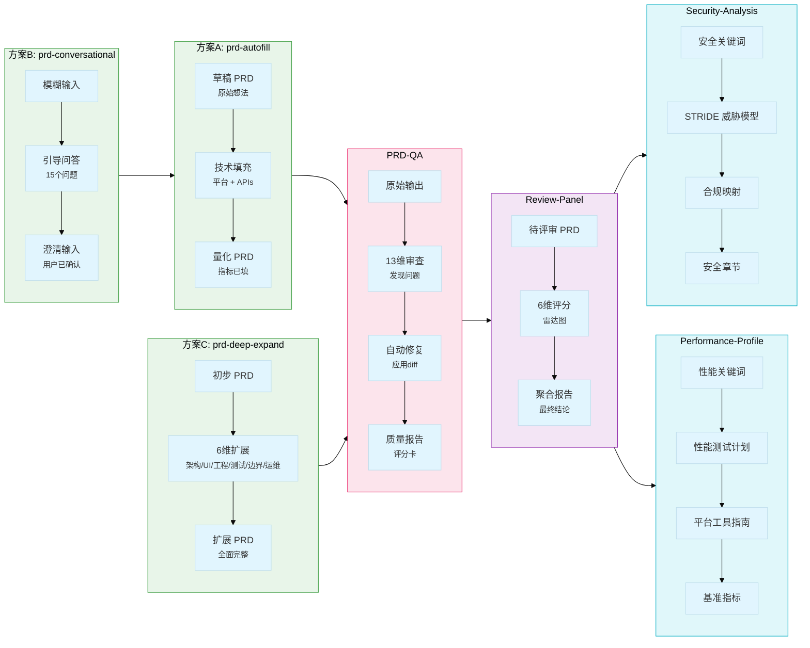
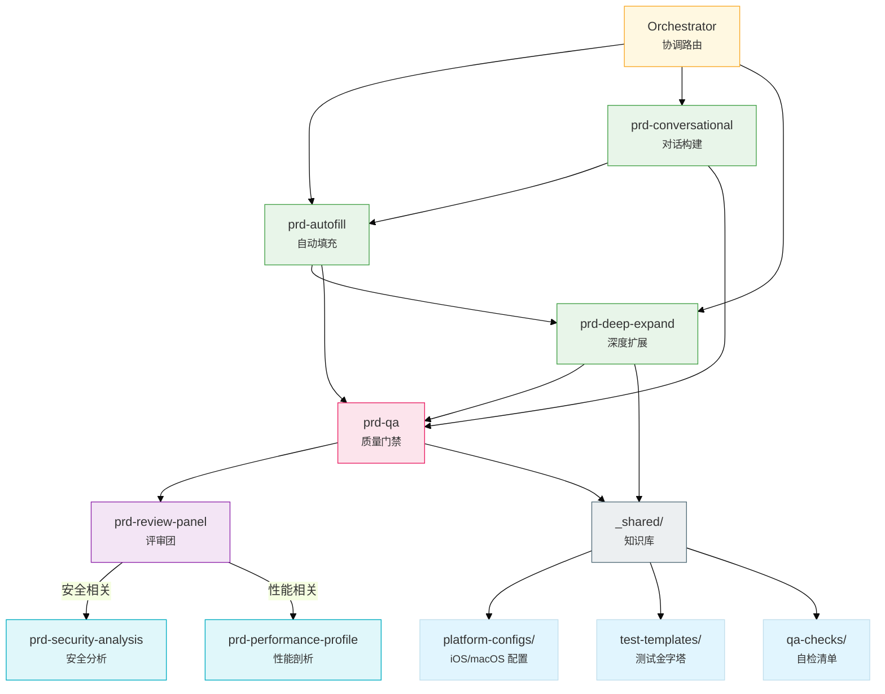
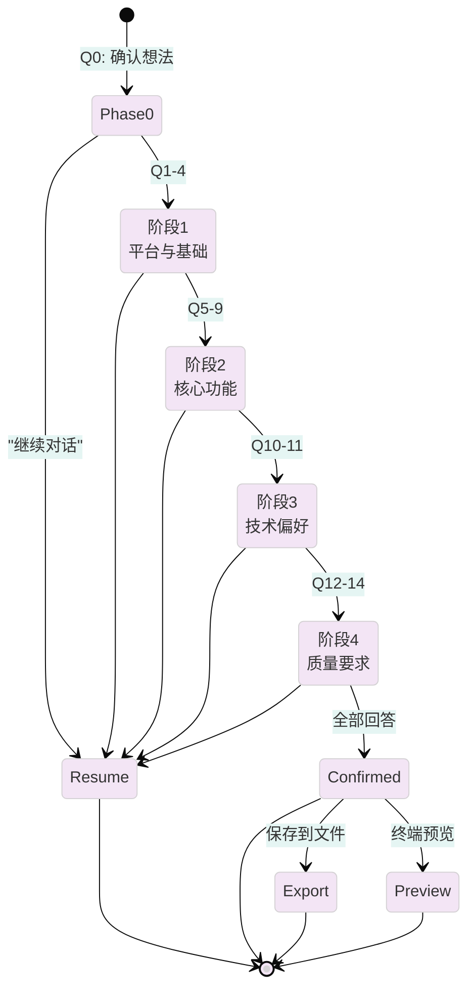
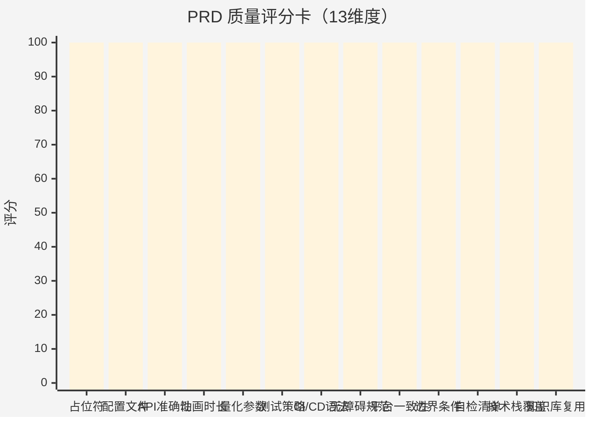

# PRD Generator

[](https://github.com/timywel)
[](LICENSE)
[](https://github.com/timywel/prompt-lab)

**作者 & 维护者**: [timywel](https://github.com/timywel)

---

PRD Generator 是一套 AI 原生的产品需求文档（PRD）生成系统。它不是简单的模板填充工具，而是一套由 **8 个专业技能**组成的智能协作网络——从一句话需求到可执行 PRD，只需几轮对话。

---

## 1. 架构总览



---

## 2. 项目能力

### 能力雷达



| 能力维度 | 说明 |
|---------|------|
| **多入口接入** | 一句话想法 → 交钥匙 PRD；或多轮对话逐步澄清 |
| **智能路由** | 自动分析需求复杂度，匹配最优生成策略 |
| **深度扩展** | 架构设计 / UI/UX / 工程化 / 测试 / 边界条件 / 运维 |
| **质量门禁** | 自动审查 PRD 常见缺陷，修复后输出质量报告 |
| **专业评审** | 6 维度评审团（技术架构、产品设计、工程实现、可执行性、UI/UX、测试策略） |
| **安全加固** | 威胁建模 / 隐私合规 / 数据加密 / API 鉴权 — 登录/支付/数据场景自动触发 |
| **性能剖析** | 性能测试计划 / 平台工具指南 / 基准指标 / 回归检测 — 高性能场景自动触发 |

---

## 3. 工作流详解

### 3.1 Orchestrator 决策树



### 3.2 PRD 数据流穿越图



### 3.3 技能协作关系图



---

## 4. 技能详解

### 4.1 prd-autofill：6步流水线


**触发**: 说 `"帮我生成一个 macOS 语音输入 App 的 PRD"`

**覆盖平台**: macOS / iOS / Android / Web / CLI / Chrome Extension

### 4.2 prd-conversational：15问状态机



**15 个问题分 4 个阶段**:

| 阶段 | 问题数 | 主题 |
|------|--------|------|
| 0 | 1 | 意图确认 |
| 1 | 4 | 平台、版本、MVP 范围 |
| 2 | 5 | 核心功能 |
| 3 | 2 | 技术偏好 |
| 4 | 3 | 质量要求 |

**触发**: 说 `"开始对话式 PRD"`

### 4.3 prd-orchestrator：复杂度决策树

| 输入类型 | 特征 | 路由 |
|----------|------|------|
| **简单型** | < 100字，单一功能，常见平台 | 仅方案A |
| **已有PRD型** | 提供文本或文件路径 | 仅方案C |
| **复杂型** | > 200字，多功能，特殊平台 | B → A → C |
| **不确定型** | 描述模糊，功能不明确 | 方案B |

**触发**: 说 `"帮我生成PRD"`（通用入口，无需选择方案）

### 4.4 prd-qa：13维度质检评分卡



| # | 维度 | 缺失时的自动操作 |
|---|------|----------------|
| 1 | 无占位符扫描 | 扫描 [TODO]/[TBD]/[FIXME] |
| 2 | 配置文件 | 自动注入 Info.plist / Entitlements |
| 3 | API 准确性 | 检测平台与 API 不匹配 |
| 4 | 动画时长矛盾 | 标记不一致的数值 |
| 5 | 量化参数完整性 | 确保延迟/内存/CPU/帧率值 |
| 6 | 测试策略完整性 | 自动注入测试金字塔模板 |
| 7 | CI/CD 语法检查 | 修正 `$${{ secrets }}` 笔误 |
| 8 | 无障碍规范检查 | VoiceOver / Dynamic Type |
| 9 | 平台一致性检查 | 验证技术栈与目标平台匹配 |
| 10 | 边界条件覆盖度 | 确保数量 >= 10 |
| 11 | 自检清单完整性 | 自动注入清单模板 |
| 12 | 技术栈完整性 | 核心 API 全覆盖检查 |
| 13 | 知识库复用检查 | 验证 `_shared/` 引用 |

**触发**: 说 `"审查 PRD"` 或在 A/B/C 输出后自动调用

### 4.5 其他技能

| 技能 | 触发关键词 | 核心输出 |
|------|-----------|----------|
| `prd-review-panel` | `"评审 PRD"` | 6维雷达图 + 聚合报告 |
| `prd-security-analysis` | 登录/支付/数据关键词 | STRIDE 威胁模型 + 合规映射 |
| `prd-performance-profile` | 实时/音视频/游戏关键词 | 性能测试计划 + 基准指标 |

---

## 5. 技能一览

| 技能 | 触发场景 | 核心价值 |
|------|----------|----------|
| `prd-autofill` | 快速启动 | 一句话进，详细 PRD 出 |
| `prd-conversational` | 需求模糊 | 多轮引导，精准澄清 |
| `prd-deep-expand` | 深度需求 | 6 维度全面扩展 |
| `prd-orchestrator` | 通用入口 | 智能分析，自动路由 |
| `prd-qa` | 质量把关 | 自动审查 + 修复 |
| `prd-review-panel` | 评审阶段 | 6 维度综合评分 |
| `prd-security-analysis` | 安全相关 | 威胁建模 / 合规 / 加密 |
| `prd-performance-profile` | 性能相关 | 测试计划 / 基准指标 |

---

## 6. 支持的平台

| 平台 | 安装方式 | 详情 |
|------|----------|------|
| Claude Code | `make install-claude` | 项目级 `.claude/skills/` |
| Cursor | `make install-cursor` | 项目级 `.cursor/skills/` |
| Windsurf | `make install-windsurf` | 项目级 `.windsurf/skills/` |
| OpenCode | `make install-opencode` | 全局 `~/.opencode/skills/prompt-lab` |
| VSCode | 手动安装 | 参考 `adapters/vscode/README_zh.md` |

---

## 7. 快速开始

### 方式一：交互式安装（推荐）
```bash
./install_zh.sh
```

### 方式二：Makefile 安装
```bash
# 安装核心平台（Claude Code + Cursor + Windsurf）
make install

# 安装所有平台
make install-all

# 安装特定平台
make install-claude   # Claude Code
make install-cursor    # Cursor
make install-windsurf  # Windsurf
make install-opencode  # OpenCode（全局）
```

---

## 8. 项目结构

```
prompt-lab/
├── skills/                    # 规范技能源（所有平台共用）
│   ├── _registry.yaml         # 技能注册表
│   ├── _shared/               # 共享知识库
│   │   ├── platform-configs/  # iOS/macOS 配置模板
│   │   ├── qa-checks/         # 自检清单
│   │   └── test-templates/    # 测试金字塔
│   └── prd-*/                 # 8个技能模块
├── adapters/                  # 各平台适配器
│   ├── claude-code/          # Claude Code
│   ├── cursor/               # Cursor
│   ├── windsurf/             # Windsurf
│   ├── opencode/             # OpenCode
│   └── vscode/               # VSCode 扩展
├── docs/                      # 项目文档（PRD/评审/规范）
├── Makefile                   # 跨平台安装/卸载
├── install.sh                 # 安装脚本（英文）
├── install_zh.sh              # 安装脚本（中文）
└── README.md
```

---

## 9. 卸载

```bash
make uninstall
# 或运行 ./install_zh.sh 选择"卸载"
```

---

## 10. 本地保留目录

以下目录包含本地集成文件，**不会**上传到仓库：
- `tmp/` — 会话临时文件
- `baize-loop/` — 本地集成

---

## 11. 相关文档

- [Claude Code 适配器](adapters/claude-code/README_zh.md)
- [Cursor 适配器](adapters/cursor/README_zh.md)
- [Windsurf 适配器](adapters/windsurf/README_zh.md)
- [OpenCode 适配器](adapters/opencode/INSTALL_zh.md)
- [VSCode 适配器](adapters/vscode/README_zh.md)
